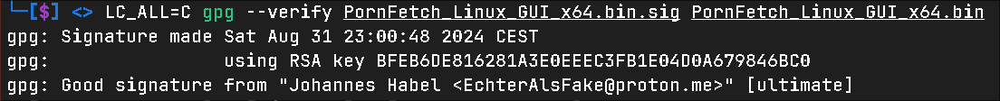

# Porn Fetch Installation & Usage Guide

Hi, in this document you will find detailed instructions how to download and use Porn Fetch 
on different platforms.

# Platforms & Verification
- [Types of Porn Fetch and 32-bit stuff](#types-of-porn-fetch-and-32-bit-executables)
- [Windows](#windows)
- [Linux](#linux)
- [Android](#android)
- [Verify downloads](#verify-downloads)
- [Configuration file](#porn-fetchs-configuration-file)

# Types of Porn Fetch and 32-bit executables
Porn Fetch has two versions. The `CLI` and the `GUI`. The CLI is a terminal interface of Porn Fetch.
It has no graphics and is intended to be used on Android (Termux) or by advanced users. The GUI version
is the classic graphical interface like any other application has too. You probably want the `GUI`!

32-bit and 64-bit:

Most processors and systems are running on 64-bit. In some very specific use cases some people need
the 32-bit version, and those can download it. For the average person the 64-bit version is the best!

# Windows
The relevant file for you is: `PornFetch_Windows_GUI_x64.exe`

After downloading it you can just double-click on it and Porn Fetch will open and is ready to be used.

### other files...
`PornFetch_Windows_CLI_x32.exe` = CLI version for 32-bit processors
 `PornFetch_Windows_CLI_x64.exe` = CLI version for 64-bit processors

# Linux
The relevant file for you is: `PornFetch_Linux_GUI_x64.bin`

After downloading the file, you need to make it executable. You can either right-click the
file and there should be a checkbox saying something like "Allow run this file as an application".
Check it, and then you can just double-click on Porn Fetch and you are ready to use it.

If you can not find the box, or double-clicking Porn Fetch does not work, you need to do it using a 
terminal.

Open a terminal in the directory where the Porn Fetch file is saved.
 Type: `chmod +x PornFetch_Linux_GUI_x64.bin` (Only one time)
 Execute with: `./PornFetch_Linux_GUI_x64.bin`

# Android
> [!NOTE]
> Not every release of Porn Fetch supports Android!

The relevant files for you are:

`PornFetch_Android_aarch64.bin`
 `PornFetch_Android_armv7.bin`
 `PornFetch_Android_x86_64.bin`
 `PornFetch_Android_i686.bin`

Depending on your phone, your CPU has a different architecture. If you do not know which architecture
your CPU has, I would recommend you to try `PornFetch_Android_aarch64.bin` first. 
 If it doesn't install with some error saying "This application is not compatible with your device" try
the other ones, until it works.

If all 4 fail, please open an Issue on GitHub!

> [!WARNING]
> Porn Fetch may take a long time to open on its first run!

# Verify downloads
If you want to verify the integrity of your downloaded files, you can follow this short guide.
After you have downloaded one of the files for your system, you will find an equivalent file on GitHub, but
ending with `.sig`

For example:

`PornFetch_Windows_GUI_x64.exe` & `PornFetch_Windows_GUI_x64.exe.sig`

After you have both files, you can verify the signature using `gpg`.
 If you do not already have gpg installed, please search Online how to do it.

The command is: `gpg --verify PornFetch_Windows_GUI_x64.exe.sig PornFetch_Windows_GUI_x64.exe`

> The first file must be the one ending with `.sig`

You should get a result like this:

The RSA Key must be: `BFEB6DE816281A3E0EEEC3FB1E04D0A679846BC0`

# Porn Fetch's configuration file

Porn Fetch saves all of its settings into a file called `config.ini`. It will automatically be
created when you first launch Porn Fetch. Deleting this file will reset all your settings.
Please make sure, that if you move Porn Fetch to another directory, that you also move the `config.ini` file
along with it.

